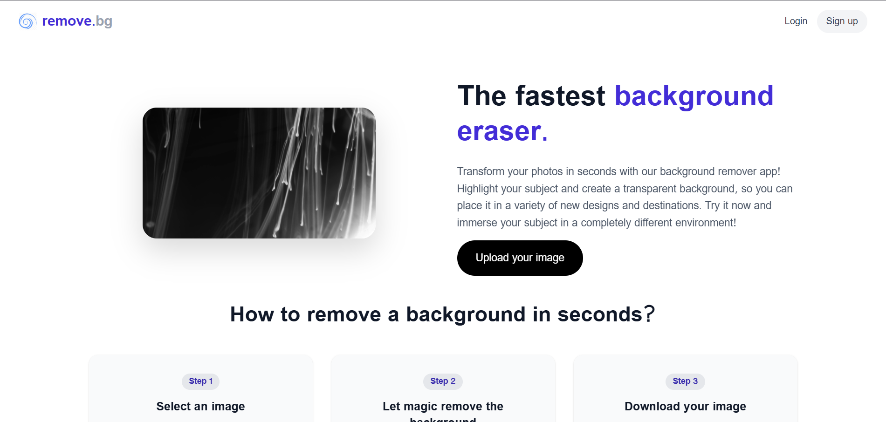
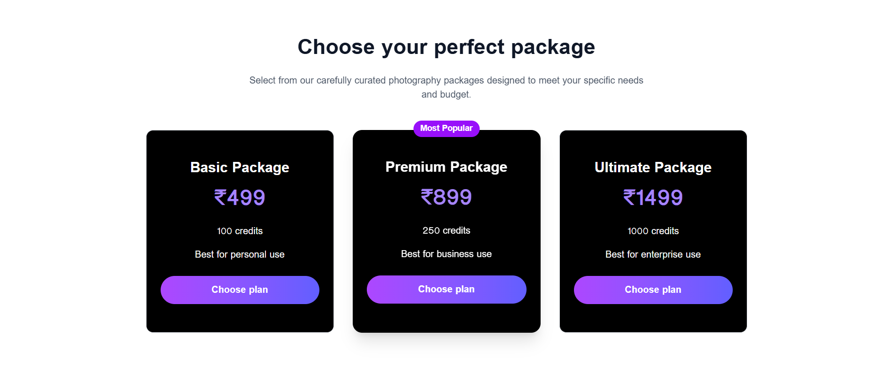
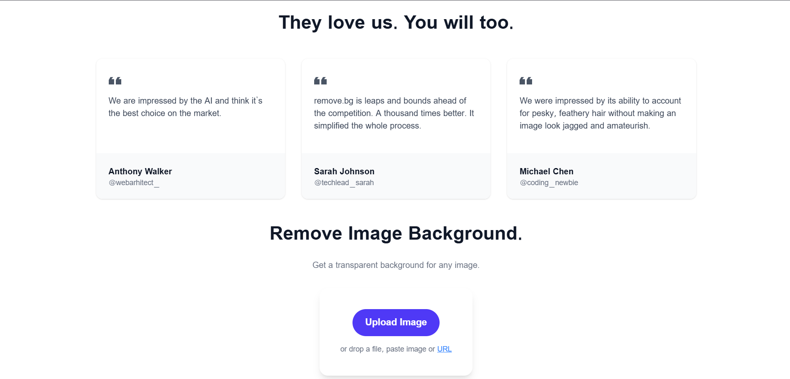
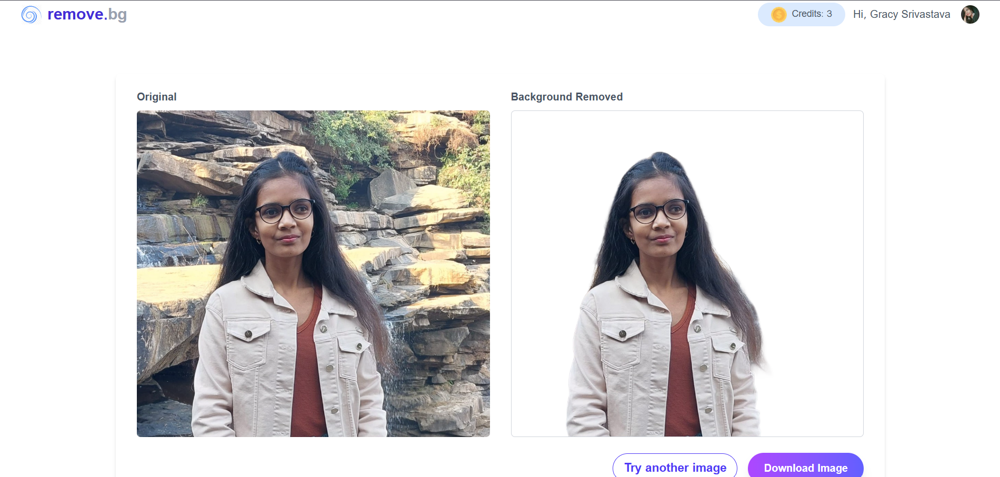

# 🪄 AI Background Remover

A full-stack web app that removes the background from any image in seconds using AI.
Users sign in, upload a photo, get a transparent-background result, and buy more credits through Razorpay.

Built with **Spring Boot** (backend) and **React + Vite** (frontend).



---

## ✨ Features

- **AI background removal**: upload an image and get a clean, transparent PNG back, powered by the Clipdrop API
- **Authentication**: sign up and log in with Clerk; the backend verifies every request with Clerk JWTs (JWKS)
- **Credit system**: every new user gets **5 free credits**, and each background removal uses 1 credit
- **Payments**: buy credit packs through **Razorpay**, with server-side payment verification
- **Before/after slider**: compare examples for people, products, animals, cars and graphics
- **Download result**: save the processed image in one click
- **User sync**: Clerk webhooks keep users in MySQL up to date
- **Responsive UI**: built with Tailwind CSS

---

## 📸 Screenshots

| Before / After Slider | Pricing |
|---|---|
|  |  |

| Upload | Result |
|---|---|
|  |  |

---

## 🛠️ Tech Stack

| Layer | Technologies |
|---|---|
| **Frontend** | React 19, Vite, Tailwind CSS, React Router, Axios, Clerk React, React Hot Toast, Lucide Icons |
| **Backend** | Java 17, Spring Boot 3.4, Spring Security, Spring Data JPA, OpenFeign, JJWT, Lombok |
| **Database** | MySQL |
| **Third-party APIs** | Clipdrop (background removal), Clerk (auth), Razorpay (payments) |

---

## 🏗️ How It Works

```
React (localhost:5173)
   │  1. User logs in with Clerk → gets a JWT
   │  2. Sends image + JWT
   ▼
Spring Boot API (localhost:8080)
   │  3. Verifies the JWT using Clerk JWKS
   │  4. Checks the user's credits in MySQL
   │  5. Sends the image to the Clipdrop API (OpenFeign)
   │  6. Deducts 1 credit, returns the processed image
   ▼
MySQL (removebgdb): users, orders
```

Buying credits: **Choose plan → backend creates a Razorpay order → user pays → backend verifies the payment signature → credits are added.**

---

## 📁 Project Structure

```
AI Background/
├── client/                     # React frontend
│   ├── src/
│   │   ├── components/         # Header, Menubar, BgSlider, Pricing, Testimonials, TryNow...
│   │   ├── pages/              # Home, Result, Pricing
│   │   ├── context/            # AppContext (global state, credits)
│   │   ├── service/            # OrderService (Razorpay)
│   │   └── assets/
│   └── .env                    # frontend environment variables
│
└── removebg/                   # Spring Boot backend
    └── src/main/java/in/gracy/removebg/
        ├── client/             # ClipdropClient (Feign)
        ├── config/             # SecurityConfig (CORS, JWT filter)
        ├── controller/         # Image, User, Order, ClerkWebhook controllers
        ├── dto/  entity/  repository/  response/
        ├── security/           # ClerkJwtAuthFilter, ClerkJwksProvider
        └── service/            # business logic (users, orders, Razorpay, bg removal)
```

---

## 🔌 API Endpoints

| Method | Endpoint | Description |
|---|---|---|
| `POST` | `/api/users` | Create or update the logged-in user |
| `GET` | `/api/users/credits` | Get the current user's credits |
| `POST` | `/api/images/remove-background` | Upload an image and get the background-removed image |
| `POST` | `/api/orders?planId=Basic` | Create a Razorpay order for a plan |
| `POST` | `/api/orders/verify` | Verify a Razorpay payment and add credits |
| `POST` | `/api/webhooks/clerk` | Clerk webhook for user sync (public) |

### 💳 Credit Plans

| Plan | Price | Credits |
|---|---|---|
| Basic | ₹499 | 100 |
| Premium | ₹899 | 250 |
| Ultimate | ₹1499 | 1000 |

---

## 🚀 Getting Started

### Prerequisites
- Java 17+
- Node.js 18+
- MySQL 8+
- Accounts and API keys for [Clerk](https://clerk.com), [Clipdrop](https://clipdrop.co/apis) and [Razorpay](https://razorpay.com) (test mode)

### 1. Clone the repository
```bash
git clone https://github.com/gracy-2003/<repo-name>.git
cd <repo-name>
```

### 2. Create the database
```sql
CREATE DATABASE removebgdb;
```

### 3. Configure the backend
Copy `removebg/src/main/resources/application.properties.example` to `application.properties` and fill in your values:

```properties
spring.datasource.url=jdbc:mysql://${MYSQL_HOST:localhost}:3306/removebgdb
spring.datasource.username=root
spring.datasource.password=YOUR_MYSQL_PASSWORD

clerk.issuer=https://YOUR-CLERK-INSTANCE.clerk.accounts.dev
clerk.jwks-url=https://YOUR-CLERK-INSTANCE.clerk.accounts.dev/.well-known/jwks.json
clerk.webhook.secret=YOUR_CLERK_WEBHOOK_SECRET

clipdrop.apikey=YOUR_CLIPDROP_API_KEY

razorpay.key_id=YOUR_RAZORPAY_KEY_ID
razorpay.key_secret=YOUR_RAZORPAY_KEY_SECRET
```

### 4. Configure the frontend
Copy `client/.env.example` to `client/.env`:

```env
VITE_CLERK_PUBLISHABLE_KEY=pk_test_xxxxxxxx
VITE_BACKEND_URL=http://localhost:8080
VITE_RAZORPAY_KEY_ID=rzp_test_xxxxxxxx
```

### 5. Run the backend
```bash
cd removebg
./mvnw spring-boot:run        # Windows: .\mvnw.cmd spring-boot:run
```
The backend runs at **http://localhost:8080**.

### 6. Run the frontend
```bash
cd client
npm install
npm run dev
```
The frontend runs at **http://localhost:5173**.

> **Note:** The backend only allows CORS requests from `http://localhost:5173`. If you change the frontend port, update `SecurityConfig.java`.

---

## 🔮 Future Improvements
- Deploy the backend (Render / Railway) and frontend (Vercel)
- Bulk image processing
- Custom background color or image replacement
- Image history for each user

---

## 👩‍💻 Author

**Gracy Srivastava**
- GitHub: [@gracy-2003](https://github.com/gracy-2003)
- LinkedIn: [gracy2003](https://www.linkedin.com/in/gracy2003)

> This project is built for learning purposes. The UI is inspired by remove.bg, and the project is not affiliated with remove.bg.

⭐ If you like this project, give it a star!
